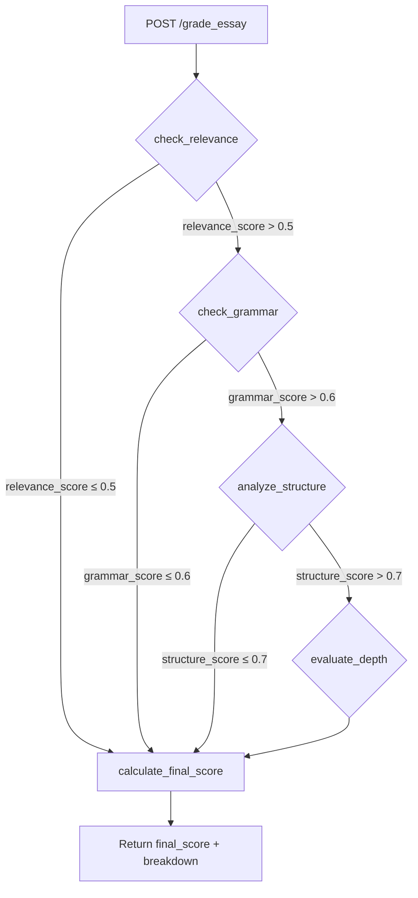

# SAGrader

A FastAPI-powered API that evaluates essays using Gemini 2.5-Flash. It analyzes each essay based on **relevance**, **grammar**, **structure**, and **depth**, and computes a final weighted score.

## Flow Chart
SAGrader workflow:


## Features
* Evaluates relevance, grammar, structure, and depth
* Weighted final score calculation
* Conditional flow using LangGraph for efficiency
* LLM-based evaluation with Gemini 2.5 Flash

## Tech Stack
* LangGraph: Workflow orchestration using conditional edges for scoring flow (relevance → grammar → structure → depth → final).
* LangChain: Provides prompt templating and LLM invocation support.
* Gemini API: Powers essay evaluation using `gemini-2.5-flash` for reasoning-based scoring.
* FastAPI: Helps to expose the grading logic as an API.
* Pydantic: Enforces data validation for request and response models in the API.

## Usage
### Setup
1. Clone the repo:
   ```bash
   git clone ..
   cd SAGrader
   ```

2. Install the dependencies:
   ```bash
   pip install -r requirements.txt
   ```

3. Set your Google API Key:
   Create a `.env` file with:
   ```env
   GOOGLE_API_KEY='your_api_key'
   ```

4. Run the Server:
   ```bash
   uvicorn server:app --reload
   ```

### API Usage
Endpoint
```bash
POST /grade_essay
```

Request Body(JSON)
```json
{
  "topic": "topic_name",
  "essay": "This is your essay text. Make sure to escape newlines with \\n if pasting from a file."
}
```

cURL eg
```bash
curl -X POST http://127.0.0.1:8000/grade_essay \
-H "Content-Type: application/json" \
-d '{"topic": "The Impact of AI in modern world", "essay": "Artificial Intelligence has impacted society..."}'
```

Output
```bash
{
  "topic": "The Impact of AI in modern world",
  "essay": "Artificial Intelligence has impacted society...",
  "relevance_score": 0.85,
  "grammar_score": 0.92,
  "structure_score": 0.88,
  "depth_score": 0.90,
  "final_score": 0.887
}
```

Example Output from Postman


